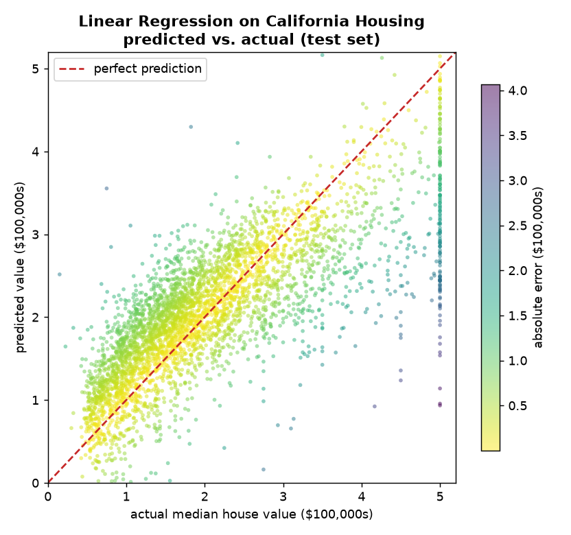
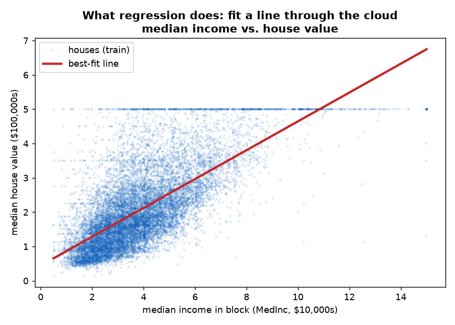
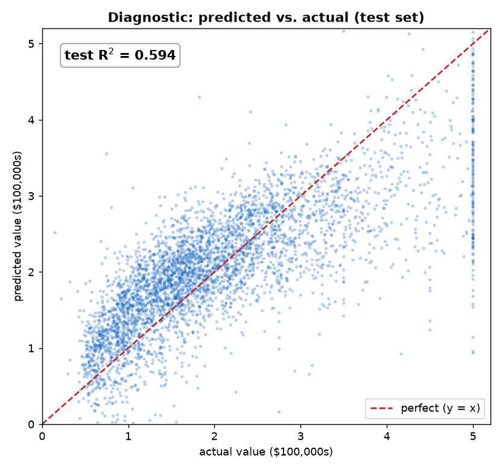
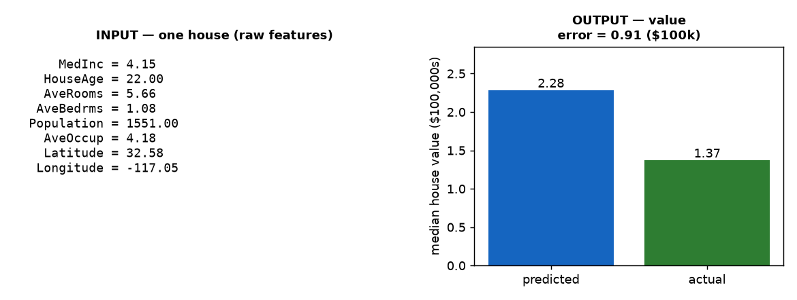

# Lesson 1 · Linear Regression — Your First Machine Learning Model

> **Stage 1 · Supervised Learning & the Optimization Engine** · Difficulty: Beginner · Dataset: California Housing (sklearn) · License: public (see `LICENSE-NOTES.md`)
> **Type:** [textbook]
>
> Part of [**classical-ML-paper2code2api**](../../../README.md) — learn machine learning by rebuilding the algorithms it's built from.

By the end of this lesson you will have built, trained, and served the very first machine learning model — the one every other model in this course is measured against — and you'll understand every line of it. No calculus, no matrix-algebra background assumed. Just basic Python and curiosity.



That scatter above is your goal: a program that looks at eight facts about a California neighborhood — median income, average rooms, location — and predicts the median house value there. Each dot is one test house; brighter (yellow) dots are accurate predictions, darker (purple) ones are further off. The red dashed line is where a perfect prediction would land. By the last section, that program will be yours, running on your machine, answering HTTP requests.

### What you'll learn

- **Why** predicting a continuous number (like a house price) is a distinct kind of ML problem, and what "fitting a model" actually means.
- **The one big idea**: a model is a set of numbers (parameters), a *loss* measures how wrong those numbers are, and *fitting* is finding the numbers that make the loss smallest.
- **How linear regression works**, step by step, and why it needs no training loop at all — there's an exact, one-shot formula for the best answer.
- **How to turn the algorithm's math into code** — reading the boxed *normal equation* and recognizing the three lines of NumPy that *are* that equation. This is the skill that lets you implement *any* method, not just this one.
- **How to train it** on California Housing and reach a test **R² ≈ 0.59** — and how to prove your from-scratch math is correct by matching scikit-learn.
- **How to wrap it in an API** so any program can send it a feature vector and get a predicted price back.

**Prerequisites:** basic Python (functions, classes, lists). This is the first build lesson — everything else is explained as it comes up.

---

## 1. The problem: predicting a number

Suppose you're handed a spreadsheet of California neighborhoods. Each row has eight measured facts — the median income of the households there, the average number of rooms per house, how old the houses are, the latitude and longitude, and a few more. And each row has one more column: the **median house value** in that neighborhood. You want a program that, given the eight facts for a *new* neighborhood it has never seen, guesses that last column.

This is **supervised learning**: you have labeled examples (facts → known answer), and you want to learn the input → output mapping so you can answer for new inputs. And because the answer you're predicting is a *continuous number* (a dollar value, not a yes/no or a category), this specific flavor is called **regression**. (When the answer is a category — "spam or not," "which digit" — it's *classification*, which arrives in Lesson 3.)

Why not just write rules by hand? You could try: "start at \$100k, add \$50k for every extra room, subtract something for age…" But you'd be *guessing* every one of those numbers, and there are eight features all pulling at once. The honest question is: **is there a principled way to let the data itself tell us the best numbers?** That's exactly what linear regression does.

Here's the shape of the data you'll be working with — a single neighborhood, as the model sees it:

```
   MedInc  =   8.30   (median income, in $10,000s)
 HouseAge  =  41.00   (median house age, years)
 AveRooms  =   6.98   (average rooms per household)
AveBedrms  =   1.02   (average bedrooms per household)
Population = 322.00   (people in the block)
 AveOccup  =   2.55   (average household size)
 Latitude  =  37.88
 Longitude = -122.23
                        →  median house value = ?   (in $100,000s)
```

That's eight numbers in, one number out. Our job is to find the recipe that turns the left side into the right.

> **A textbook algorithm.** Linear regression has no single seminal paper; it traces back to the **method of least squares**, published by **Adrien-Marie Legendre in 1805** and developed independently by **Carl Friedrich Gauss** (who claimed use from around 1795 and published ~1809). Two centuries later, the exact formula they derived is still the one we'll code. We build the standard modern formulation.

---

## 2. The big idea: a model, a loss, and a fit

Every supervised model in this course — and in machine learning generally — is really just three things. Linear regression is the simplest honest example of all three, which is why it goes first.

### The model: a weighted sum

A **linear model** predicts the answer as a weighted sum of the input features, plus a constant. For our eight housing features:

```
value ≈ w₀·MedInc + w₁·HouseAge + … + w₇·Longitude  +  b
```

Each **weight** `w` says how much that feature pushes the prediction up or down (a positive weight on income means "richer neighborhood → pricier houses"), and the **bias** `b` (also called the intercept) is the baseline the sum starts from. That's the *entire* model. For eight features it's just **nine numbers**: eight weights and one bias. Find good values for those nine numbers and you have a working price predictor.

The word "linear" simply means we only ever *scale each feature and add* — no squaring, no multiplying features together. Geometrically, with one feature you're fitting a straight **line** through a cloud of points; with eight features it's a flat plane in higher dimensions, but the intuition is identical.

### The loss: how wrong are we?

Given some choice of weights, how do we know if it's any good? We measure the **error** on our labeled examples. For one house, the error is just *predicted value − actual value*. Some predictions land high, some low, so we **square** each error (to make them all positive and to punish big misses more than small ones) and average over all the houses. That average is the **Mean Squared Error (MSE)** — our **loss function**:

```
loss = average of (predicted − actual)²  over all training houses
```

A big loss means the weights are bad; a loss of zero would mean every prediction is perfect. **Fitting the model = finding the weights that make this loss as small as possible.** Every model you'll build is some version of this same sentence — the only thing that changes is the shape of the model and the exact loss.

### The fit: solving for the best weights

Here's the part that makes linear regression special and satisfying. For most models, minimizing the loss requires *iteration* — nudging the weights over and over (that's Lesson 2, gradient descent). But for linear regression with MSE, the minimum can be written down **exactly, in one shot**, with a formula from linear algebra called the **normal equation**. No loop, no learning rate, no waiting. You solve one equation and you're done. We'll meet that formula properly in §4.

> That's the whole idea. **A model is some numbers; a loss scores how wrong they are; fitting finds the numbers that minimize the loss.** Everything below is just this idea made concrete — and for linear regression, the "finding" happens to be a single line of algebra.

---

## 3. Linear regression, step by step

Because there's no training loop, the "algorithm" here is beautifully short:

```
fit(X, y):
    1. glue a column of 1s onto X  (so the bias rides along as just another weight)
    2. solve the normal equation for the best weights + bias   ← one shot, exact
    3. store them

predict(X):
    return  X · weights + bias        (a weighted sum per row)
```

That's it — two methods, no iteration. Here's `fit` in `model.py`, which maps onto the sketch almost line for line:

```python
def fit(self, X: np.ndarray, y: np.ndarray) -> "LinearRegression":
    X = np.asarray(X, dtype=np.float64)
    y = np.asarray(y, dtype=np.float64)

    # Prepend a column of 1s so the bias is learned as just another weight.
    # Xb has shape (n_samples, n_features + 1).
    ones = np.ones((X.shape[0], 1))
    Xb = np.hstack([ones, X])

    # The normal equation: theta = (Xb^T Xb)^-1 Xb^T y.
    theta, *_ = np.linalg.lstsq(Xb, y, rcond=None)

    # theta[0] is the bias (weight on the all-ones column); the rest are weights.
    self.bias = float(theta[0])
    self.weights = theta[1:]
    return self
```

Read it against the sketch. **Step 1** is the `np.hstack` that glues a column of ones onto `X`. This is a small, clever trick: instead of treating the bias `b` as a special separate thing, we pretend there's an extra "feature" that's always `1`. Its weight then *is* the bias, and the single formula solves for the bias and the real weights all at once. **Step 2** is the `np.linalg.lstsq` call — one line that computes the exact best answer (we'll unpack exactly what it's doing in §4). **Step 3** peels the result apart: the first number is the bias, the rest are the per-feature weights.

`predict` is even shorter — just the weighted sum from §2:

```python
def predict(self, X: np.ndarray) -> np.ndarray:
    if self.weights is None:
        raise RuntimeError("Model is not fitted yet. Call fit(X, y) first.")
    X = np.asarray(X, dtype=np.float64)
    return X @ self.weights + self.bias
```

The `@` is NumPy's matrix-multiply; here it computes the dot product of each row's features with the learned weights, and `+ self.bias` adds the baseline. One line does every prediction at once.

**How "big" is this model?** Where the CV course's LeNet-5 had 61,706 weights, linear regression on eight features has exactly **nine numbers**: one weight per feature, plus the bias. That's the entire trained artifact. You can see the whole thing on one screen — which is exactly why it's the first lesson and the baseline every later model must beat.

### See it actually work

Don't take the formula on faith — `model.py` ships with a sanity check at the bottom that fits on data with a *known* answer. It builds a synthetic dataset from the exact rule `y = 3·x₀ − 2·x₁ + 5`, fits the model, and checks whether it recovers those numbers:

```bash
python model.py
```
```
fitted; train R^2: 1.0000  |  params: 3  (weights=[ 3. -2.], bias=5.000)
```

It nailed it: the recovered weights are `[3, -2]` and the bias is `5.000`, precisely the rule we baked in. The `train R^2: 1.0000` means the fit is perfect (more on R² in §6) — which it should be, because this toy data really is exactly linear. This is the "proof it works" moment: the math isn't a black box, it recovered a relationship we planted, down to the decimal.

Real data is never *exactly* linear, of course. Here's what the fit looks like on genuine California housing data, using the single strongest feature (median income) so we can draw it in 2-D:


*The blue cloud is real neighborhoods (income on the x-axis, house value on the y-axis); the red line is the least-squares fit. Richer areas trend more expensive — the line captures that trend, even though no single line can thread every point. The full model uses all eight features at once; this is just the slice we can see.*

---

## 4. From the algorithm's math to code

This is the signature section of the whole course — the leap from *math on a page* to *code that runs*. A textbook states linear regression as a formula dense with transposes and inverses; your job is to recognize *which line of code is that formula*. Do this a few times and the symbols stop being scary — you start seeing the NumPy hiding inside them.

> **How to read this:** for each piece we show the math, translate every symbol into plain words, then show the code that implements it.

### 4.1 The loss being minimized — Mean Squared Error

Everything starts from the loss. Written formally, MSE across `n` training houses is:

$$
\text{MSE}(w, b) \;=\; \frac{1}{n}\sum_{i=1}^{n}\big(\hat{y}_i - y_i\big)^2
\qquad\text{where}\qquad \hat{y}_i = x_i \cdot w + b
$$

Symbol by symbol:

- $y_i$ — the **actual** house value for neighborhood $i$ (the label).
- $\hat{y}_i$ (“y-hat”) — the model's **predicted** value: the dot product of that row's features $x_i$ with the weights $w$, plus the bias $b$. This is the weighted sum from §2.
- $(\hat{y}_i - y_i)^2$ — the squared error for one house.
- $\frac{1}{n}\sum$ — average it over all $n$ houses.

This is the number we want to make as small as possible. In `train.py` we don't compute MSE directly to fit (the formula below does that for us), but the same quantity appears when we score the model — R² is built from exactly this sum of squared errors.

### 4.2 The model as a matrix — stacking the equation for every row

Writing $\hat{y}_i = x_i \cdot w + b$ one house at a time is tedious. Linear algebra lets us write **all** the predictions at once. Stack every house's features as a row of a matrix $X_b$ (the little `b` means we've prepended that column of ones from §3, so the bias is absorbed into the weight vector $\theta$):

$$
\hat{y} \;=\; X_b\,\theta
$$

- $X_b$ — the feature matrix, shape (n houses × 9): a row per house, a column per feature, plus the leading all-ones column.
- $\theta$ (“theta”) — all nine parameters in one vector: $\theta_0$ is the bias, $\theta_1 \dots \theta_8$ are the feature weights.
- $\hat{y}$ — the whole vector of predictions, one per house, computed in a single matrix multiply.

That's the `Xb = np.hstack([ones, X])` and the `X @ self.weights + self.bias` you already saw. One matrix multiply *is* the entire model applied to the entire dataset.

### 4.3 The normal equation — solving for the best weights in one shot

Here's the payoff. The choice of $\theta$ that minimizes the MSE in §4.1 is not found by trial and error — it's given exactly by the **normal equation**:

$$
\boxed{\;\theta \;=\; \big(X_b^{\top} X_b\big)^{-1} X_b^{\top}\, y\;}
$$

Reading it symbol by symbol:

- $X_b^{\top}$ — the **transpose** of the feature matrix (rows become columns).
- $X_b^{\top} X_b$ — a small square matrix (9×9 here) that summarizes how the features co-vary with each other.
- $(\;\cdot\;)^{-1}$ — the matrix **inverse**, the linear-algebra analogue of dividing.
- $X_b^{\top} y$ — how each feature co-varies with the target.
- Put together: "divide the feature-target relationship by the feature-feature relationship," and out pops the best $\theta$. It's the multi-feature generalization of the school-algebra formula for the slope of a best-fit line.

Translated *literally* into NumPy, the boxed formula is one line:

```python
theta = np.linalg.inv(Xb.T @ Xb) @ Xb.T @ y      # the normal equation, verbatim
```

You can read that left to right against the math: `.T` is the transpose $^{\top}$, `np.linalg.inv` is the inverse $(\cdot)^{-1}$, and `@` is matrix multiplication. **A line of intimidating math becomes a line of well-named NumPy.**

> **The one place math and code differ — read this carefully.** Our `model.py` does *not* call `np.linalg.inv`. It uses:
> ```python
> theta, *_ = np.linalg.lstsq(Xb, y, rcond=None)
> ```
> `lstsq` ("least squares") solves the *same* minimization problem and returns the *same* $\theta$ the boxed formula does — but it does so via a technique called SVD instead of literally forming the inverse. Why? Explicitly computing $(X_b^{\top} X_b)^{-1}$ can be **numerically unstable**: if two features are nearly redundant, that inverse blows up small rounding errors into large ones. `lstsq` sidesteps the inverse entirely and stays accurate even when the data is awkward. Think of the boxed equation as *what* we're solving and `lstsq` as a sturdier *how*. Both give the identical answer on well-behaved data — which we're about to prove by matching scikit-learn to four decimal places.

The lesson of this whole section: seeing that the normal equation *is* three NumPy calls — and knowing when to trade the literal formula for a stabler equivalent — is the transferable skill. You're not memorizing a library; you're learning to read math as code.

---

## 5. Faithful vs. modernized — what we changed and why

This course is honest about every place the code departs from the "textbook literal" version. For linear regression there are only two, and both are about robustness, not shortcuts:

1. **We solve with `np.linalg.lstsq`, not by forming `(XᵀX)⁻¹` by hand.** The classic textbook writes the normal equation with an explicit matrix inverse (§4.3). We compute the mathematically identical solution with `lstsq`, which is SVD-based and numerically stable — it won't blow up if two features are nearly collinear, and it handles rank-deficient data gracefully. Same answer, sturdier arithmetic.

2. **We standardize the features before fitting.** Raw housing features live on wildly different scales (population in the hundreds, average occupancy near 2). In `train.py` we rescale each feature to zero mean and unit spread — and critically, we compute that mean/spread on the **training set only**, then apply it to the test set, so no test information leaks into training. (For the pure normal equation, standardizing doesn't change the *quality* of the fit — but it keeps the numbers well-conditioned and makes the learned weights comparable, and it's essential practice for every scaled model in later lessons.)

Kept faithfully: **the model and its objective — a linear weighted sum fit by exact least-squares minimization of MSE.** That's what makes this linear regression, and it's untouched. Whenever this course simplifies or adjusts something, you'll find a section exactly like this one telling you what and why.

---

## 6. Build it yourself

You'll work through the files in order: `model.py` (done — that was §3), then `train.py` to fit it on real data, then `infer.py` to make predictions.

> **Already-trained parameters ship with this lesson.** The repo includes a ready-made `linear_regression.npz`, so `infer.py` and the API work the instant you clone — no waiting. We still walk through `train.py` next because *fitting it yourself* is the whole point; running it simply overwrites the artifact with your own freshly-learned parameters.

**Setup.** From inside the `01-linear-regression` folder:

```bash
pip install -r requirements.txt
```

### Training — `train.py`

Training here has a fixed shape you'll see in every lesson: load the data, split it honestly, fit the model, score it on data it never saw. Let's read the important parts.

First, load the data and split it — with a fixed seed so the split is reproducible:

```python
data = fetch_california_housing()
X, y = data.data, data.target        # X: (20640, 8), y: median value in $100k

X_train, X_test, y_train, y_test = train_test_split(
    X, y, test_size=test_size, random_state=seed    # seed fixed → same split every run
)
```

The **train/test split** is the heart of honest evaluation: we hold back 20% of the neighborhoods, fit only on the other 80%, and judge the model on the held-out 20% — data it has genuinely never seen. Scoring on data you trained on would be like grading a student on the exact questions they studied; it tells you nothing about *generalization*.

Next, standardize the features — fitting the scaler on the **training set only** (this is the no-leakage rule from §5):

```python
mean = X_train.mean(axis=0)
scale = X_train.std(axis=0)
scale[scale == 0.0] = 1.0            # guard: never divide by zero on a constant column
X_train_scaled = (X_train - mean) / scale
X_test_scaled = (X_test - mean) / scale
```

Then the part you've been building toward — one line to fit:

```python
model = LinearRegression().fit(X_train_scaled, y_train)
```

Finally, score it on the held-out test set and, importantly, compare against two **baselines**:

```python
r2_test = r2_score(y_test, model.predict(X_test_scaled))

baseline_mean = r2_score(y_test, np.full_like(y_test, y_train.mean()))   # predict the mean
sk = SklearnLinearRegression().fit(X_train_scaled, y_train)              # library reference
r2_sklearn = r2_score(y_test, sk.predict(X_test_scaled))
```

Run it:

```bash
python train.py
```
```
dataset: California Housing  |  X=(20640, 8)  features=['MedInc', 'HouseAge', ...]
test R^2 (ours):      0.5943
test R^2 (mean base): -0.0003   <- the floor to beat
test R^2 (sklearn):   0.5943   <- should match ours
saved -> linear_regression.npz
```

Let's read those three numbers, because they're the whole point of honest evaluation.

**R²** ("R-squared") is the standard score for regression: it's the fraction of the target's variance the model explains. **R² = 1.0** is perfect; **R² = 0.0** means the model is no better than always guessing the average price; negative means it's *worse* than that. Our model scores **0.5943** — it explains about 59% of the variation in house values from those eight features. That's not a typo-perfect fit, and it shouldn't be: house prices depend on plenty the dataset doesn't capture (school districts, the specific street, the year). For a first model on real data, ~0.59 is a genuinely respectable, honest result.

The two baselines are there to keep us honest, and they tell a clear story:

- **The mean baseline scores −0.0003** (essentially 0.0, the floor). Always predicting the average house value explains nothing — this is the bar any real model must clear, and ours clears it by a mile.
- **scikit-learn's `LinearRegression` scores 0.5943 — identical to ours to four decimals.** This is the correctness proof promised in §4: scikit-learn fits the exact same normal equation, so matching it means our from-scratch math is right. We built it ourselves *and* it agrees with the reference implementation. That's the satisfying confirmation that you understand the thing, not just imported it.

Here's the diagnostic picture — predicted vs. actual on the test set:


*Each dot is a test neighborhood; the dashed line is a perfect prediction. Points hug the line where the model does well and scatter where it struggles — notably along the right edge, where the dataset caps *actual* house values at \$500k (they pile up at 5.0), so the model over- and under-shoots that vertical band. The R² = 0.594 in the corner is that same test score, drawn.*

### Inference — `infer.py`

Training's done; now we *use* the saved parameters. `infer.py` loads them once (cached), then turns one feature vector into a prediction. The caller sends **raw, unscaled** features — the artifact carries the scaler, so callers never need to know the training statistics:

```python
@lru_cache(maxsize=1)
def load_model() -> tuple[LinearRegression, np.ndarray, np.ndarray]:
    if not ARTIFACT_PATH.exists():
        raise FileNotFoundError(
            f"artifact not found at {ARTIFACT_PATH}. Run `python train.py` first."
        )
    data = np.load(ARTIFACT_PATH, allow_pickle=False)
    model = LinearRegression()
    model.weights = data["weights"]
    model.bias = float(data["bias"])
    return model, data["mean"], data["scale"]
```

The `@lru_cache` means the `.npz` file is read from disk only **once**, no matter how many predictions you make — important for the API, which shouldn't reload on every request. The `predict` function then applies the *same* scaling the model was trained with, and returns the contract's regress shape:

```python
def predict(features: list[float]) -> dict:
    if len(features) != len(FEATURE_NAMES):
        raise ValueError(
            f"expected {len(FEATURE_NAMES)} features {FEATURE_NAMES}, "
            f"got {len(features)}."
        )
    model, mean, scale = load_model()
    x_raw = np.asarray(features, dtype=np.float64)
    x_scaled = (x_raw - mean) / scale                 # same scaling as training
    value = float(model.predict(x_scaled.reshape(1, -1))[0])
    return {"value": value}
```

Note the length check up front — send the wrong number of features and it fails loudly with a helpful message rather than silently mispredicting. Try it from the command line on that example neighborhood from §1:

```bash
python infer.py '[8.3, 41, 6.98, 1.02, 322, 2.55, 37.88, -122.23]'
```
```
{'value': 4.124749479986032}
```

The model predicts **4.12** for this neighborhood. Hold that number in mind — its *units* are the single most common trap in this lesson, and §9 is entirely about not misreading it.

---

## 7. From model to API — `api.py`

A trained model sitting in a `.npz` file isn't useful to anyone else. The final step of every lesson is to wrap it in a web API so any program (or person, via `curl`) can send it a feature vector and get a prediction back. We use **FastAPI**, a popular, beginner-friendly Python web framework.

Every model in classical-ML-paper2code2api speaks the **same contract**, so they're interchangeable:

```
POST /predict   (JSON: {"features": [f1, ..., f8]})  -> { "value": <float> }
GET  /health                                         -> { status, model_loaded }
```

The `/predict` endpoint does almost no new work — it's a thin wrapper over the same `predict()` you just met in `infer.py`, with graceful handling for the two obvious failures:

```python
@app.post("/predict")
def predict_endpoint(payload: PredictRequest) -> dict:
    try:
        return predict(payload.features)
    except ValueError as exc:
        # Wrong number of features / malformed vector -> client error.
        raise HTTPException(status_code=400, detail=str(exc))
    except FileNotFoundError as exc:
        # Artifact missing -> model not trained yet.
        raise HTTPException(status_code=503, detail=str(exc))
```

Keeping the real logic in `infer.py` is what makes this possible: the API is just plumbing. There's also a small `startup` hook that warm-loads the parameters so the very first request isn't slow.

Start the server:

```bash
uvicorn api:app --reload
```

Then open **http://127.0.0.1:8000/docs** for FastAPI's interactive page — you can fill in a feature vector and see the response, no code required. Or use `curl`:

```bash
curl -X POST http://127.0.0.1:8000/predict \
  -H "Content-Type: application/json" \
  -d '{"features": [8.3, 41, 6.98, 1.02, 322, 2.55, 37.88, -122.23]}'
```
```jsonc
{ "value": 4.124749479986032 }
```

Same neighborhood, same answer as the command line — because it's the same `predict()` underneath. And the health check:

```bash
curl http://127.0.0.1:8000/health
```
```jsonc
{ "status": "ok", "model_loaded": true }
```

**A note on error handling — two different "bad request" codes.** The API distinguishes *two* kinds of malformed input, and it's worth knowing which is which:

- Send a **well-formed** JSON body but the **wrong number of features** — say three instead of eight — and our own length check fires, returning **HTTP 400**:
  ```jsonc
  { "detail": "expected 8 features ['MedInc', 'HouseAge', ...], got 3." }
  ```
- Send a body that's **missing the `features` key entirely**, and you never reach our code — **FastAPI's pydantic validation** rejects it first with **HTTP 422**. That's automatic: the `PredictRequest` model declares `features` as required, so a request without it is invalid before the endpoint even runs.

Both are the caller's fault (4xx), but the split is a useful mental model: **422 = "this doesn't match the shape I require"** (handled for free by the type declaration), **400 = "the shape is fine but the values don't make sense"** (your own validation).


*One test house: its eight raw features on the left, the predicted value vs. the actual value on the right. This is the input→output relationship the API delivers, made visible.*

*(Regenerate these figures any time with `python make_examples.py`.)*

---

## 8. In production

Linear regression isn't a museum piece — it's the workhorse that quietly runs underneath an enormous amount of real software, precisely *because* it's simple, fast, and explainable:

- **Home-value estimation.** Zillow's early "**Zestimate**" began life as a regression on home features and location — the same problem you just solved, at national scale.
- **Demand forecasting.** Retailers predict how many units a store will sell next week from price, season, and promotions — often a linear model first, because it's cheap to retrain nightly and easy to sanity-check.
- **Insurance-premium baselines.** Actuaries start with linear models relating risk factors to expected cost; the transparency matters when a regulator asks *why* a premium is what it is.
- **Marketing spend → revenue.** "Marketing-mix models" that attribute revenue to ad channels are, at their core, regressions — the coefficients *are* the answer the business wants.

The through-line: **when the thing you're predicting is a number, linear regression is the default first model** — the honest baseline you build before reaching for anything fancier. Often it's good enough to ship; when it isn't, it's the yardstick you measure the fancier model against. That baseline role is exactly why it opens this course.

---

## 9. The #1 gotcha: misreading the output units

Here's the mistake that trips up nearly everyone the first time. You call the model, it returns `4.12`, and your brain reads **"\$4.12."** A house worth four dollars and twelve cents? Something must be broken.

Nothing's broken — **you're reading the wrong units.** The California Housing target is median house value measured in **units of \$100,000s**. So a prediction of `4.12` means:

```
4.12  ×  $100,000  =  ~$412,000
```

A perfectly sensible California home price. The model is doing exactly the right thing; the trap is purely in interpreting its output. This isn't a quirk of one dataset — it's a habit worth building for *every* regression you ever run: **before you trust a predicted number, know its units.** Is the target in dollars, thousands of dollars, log-dollars, a percentage, a count? The model neither knows nor cares — it faithfully predicts numbers on whatever scale you trained it, and it's on you to translate back.

(An honorable-mention trap for regression specifically: **extrapolating beyond the training range.** Linear regression will happily draw its line out to a neighborhood with an income of \$2,000,000 or a house age of 300 years and hand you a confident number — but it learned nothing about those regimes, so the answer is a fantasy. Trust predictions near the data the model actually saw.)

> **Common mistake:** A regression prediction is only meaningful in the **units of the target it was trained on**. Here `4.12` is **~\$412,000**, not \$4.12 — the California Housing target is in \$100,000s. Always know your target's units before you act on a number, and be wary of predictions far outside the training range.

---

## 10. Exercises — try it yourself

Work these in order; each builds a little more intuition. (Suggested solutions are an exercise in reading the code you already have.)

1. **Read the raw prediction back in dollars (easy).** Run `python infer.py '[8.3, 41, 6.98, 1.02, 322, 2.55, 37.88, -122.23]'`, take the returned `value`, and multiply by \$100,000. Now change `MedInc` from `8.3` to `3.0` (a poorer neighborhood) and predict again. *Lesson: the units live in your head, not the model — and income moves the prediction the way intuition says it should.*

2. **Change the split, watch R² wobble (easy).** Run `python train.py --seed 7`, then `--seed 42`. Does the test R² stay near 0.59? *Lesson: a single train/test split is a noisy estimate — the score shifts a little with which houses land in the test set. (Lesson 4 fixes this with cross-validation.)*

3. **Call your API and confirm it matches the CLI (medium).** Start the server, POST the feature vector from §7, then send it again via the CLI `infer.py`. Confirm the `value` is byte-for-byte identical. Then POST only three features and read the 400 error. *Lesson: the API is a thin wrapper over one `predict()` — same input, same answer — and it fails loudly, not silently, on bad input.*

4. **Prove the bias is the mean-ish baseline (medium).** In `model.py`'s sanity check, fit the model but then predict on an all-zeros feature vector. What comes out, and why is it the bias? *Lesson: with standardized features, an "average" input (all zeros) predicts the intercept — the bias is the model's baseline guess.*

5. **Break the no-leakage rule and measure the damage (harder).** In `train.py`, deliberately compute `mean`/`scale` on the *full* `X` (before the split) instead of on `X_train` only, retrain, and compare the test R². *Lesson: scaling before the split leaks test statistics into training — the exact anti-pattern §5 warns against. (The effect is small here; on smaller datasets it can badly inflate your score.)*

6. **Find the strongest feature (harder).** After training, load `linear_regression.npz` and print `weights` alongside `FEATURE_NAMES`. Which feature has the largest-magnitude weight? Does it match the "median income" story from the §3 figure? *Lesson: because features are standardized, the weights are directly comparable — the biggest one is the strongest driver of price.*

> **Common mistake:** After editing `model.py`, you **must re-run `train.py`** — the shipped `linear_regression.npz` belongs to the old code and won't match a changed model. Delete `linear_regression.npz`, rerun `python train.py`, then test.

---

## 11. Recap & what's next

You just built the first machine learning model from the ground up — and it's the one every later lesson is compared against. Here's what you now understand:

- **The three-part anatomy of a model** — a set of parameters, a loss (MSE) that scores how wrong they are, and a fit that finds the parameters minimizing the loss. Every supervised model in this course is a variation on this.
- **Linear regression itself** — a weighted sum of features plus a bias, just nine numbers for eight features, and how `fit`/`predict` map line-for-line onto `model.py`.
- **Math → code** — how the boxed normal equation `θ = (XᵀX)⁻¹Xᵀy` becomes three NumPy calls, and why the code uses the numerically stabler `lstsq` for the identical answer.
- **The full pipeline** — load → honest train/test split → fit (R² ≈ 0.59 on California Housing, matching scikit-learn to four decimals and crushing the mean baseline) → infer → serve a `POST /predict` API — plus the units gotcha (4.12 means ~\$412k) that trips everyone up once.

Notice what was *missing* here: there was no training loop. The normal equation handed us the exact best weights in one shot. That's a luxury unique to this problem — most models have no closed-form answer, and even linear regression becomes impractical to solve this way when you have millions of features. So we need a different engine: one that starts with a guess and *iteratively* improves it, step by step, following the loss downhill.

**Next: [Lesson 2 · Gradient Descent](../02-gradient-descent)** — we'll re-fit *this exact linear regression model*, but instead of the closed-form equation, we'll nudge the weights toward the minimum one small step at a time. It's the optimizer that powers logistic regression, SVMs, and every neural network in the paid course — taught once here, on a model you already understand.

← Back to the [**course home**](../../../README.md)

---

### Files in this lesson

| File | Purpose |
|---|---|
| `README.md` | This lesson |
| `model.py` | Linear regression from scratch (NumPy) — the reference implementation |
| `train.py` | Fit on California Housing, save `linear_regression.npz` |
| `linear_regression.npz` | Pretrained parameters (ship with the repo) — `infer.py`/`api.py` work on clone; `train.py` overwrites it |
| `infer.py` | Preprocess + predict; usable standalone or as a library |
| `api.py` | FastAPI server exposing the shared `POST /predict` contract |
| `make_examples.py` | Generates the input/output example figures (`examples_grid`, `prediction_detail`) |
| `make_figures.py` | Generates the teaching diagrams (`fit_line`, `pred_vs_actual`) |
| `requirements.txt` | Dependencies |
| `LICENSE-NOTES.md` | License status (safe to ship) |
